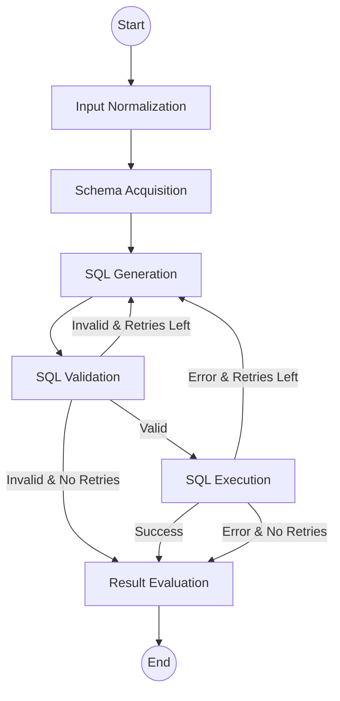

# Architecture

This document describes the architecture of Vanna LangGraph, a text-to-SQL system built on LangGraph.

## Overview

Vanna LangGraph uses a **StateGraph** pattern to orchestrate the text-to-SQL conversion process. The graph explicitly models:

- **State transitions** through typed `VannaState`
- **Self-correction loops** via conditional edges
- **Tool execution** through LangChain tools

## Core Components

### VannaState

The central state schema that flows through all nodes:

```python
class VannaState(TypedDict):
    messages: List[BaseMessage]       # Conversation history
    user_question: str                # Original question
    normalized_question: str          # Cleaned question
    database_schema: str              # Schema context
    generated_sql: str                # Current SQL
    is_sql_valid: bool               # Validation status
    sql_result: Dict                  # Execution result
    retry_count: int                  # Current attempts
    final_answer: str                # Response to user
```

### Graph Structure



## Nodes

| Node | Purpose |
|------|---------|
| **Input Normalization** | Clean input, expand abbreviations |
| **Schema Acquisition** | Load relevant database schema |
| **SQL Generation** | Generate SQL using LLM |
| **SQL Validation** | Check syntax, schema, security |
| **SQL Execution** | Run SQL against database |
| **Result Evaluation** | Generate natural language answer |

## Conditional Edges

The graph uses conditional edges for routing based on state:

- `is_sql_valid`: Routes to execution or retry
- `should_retry_sql`: Checks retry count vs max
- `execution_succeeded`: Routes to evaluation or retry

## LangChain Integration

### Tools

Tools are implemented as LangChain `@tool` decorated functions:

- `get_database_schema`: Query schema information
- `execute_sql`: Run SQL queries
- `validate_sql`: Validate SQL syntax/security

### LLM Providers

Provider-agnostic LLM access through factory pattern:

```python
from vanna_langgraph.providers import get_llm, LLMConfig

config = LLMConfig(provider="openai", model="gpt-4o")
llm = get_llm(config)
```

## Self-Correction Loop

The retry mechanism:

1. SQL generation fails validation → Add to `correction_history`
2. Regenerate with error context in prompt
3. Continue until success or `max_retries` reached

```python
# correction_history provides context for improvement
if not is_valid:
    correction_history.append({
        "original_sql": sql,
        "error": error_message,
    })
```

## Extension Points

- **Custom nodes**: Add new processing steps
- **LLM providers**: Implement new provider in `providers/`
- **Tools**: Add domain-specific tools
- **State fields**: Extend VannaState for custom data
